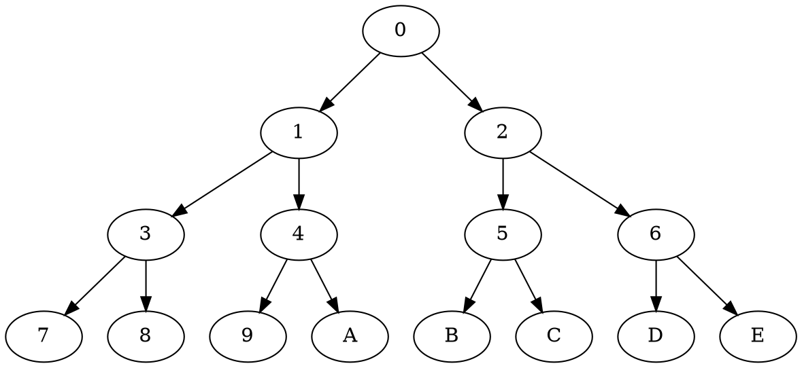
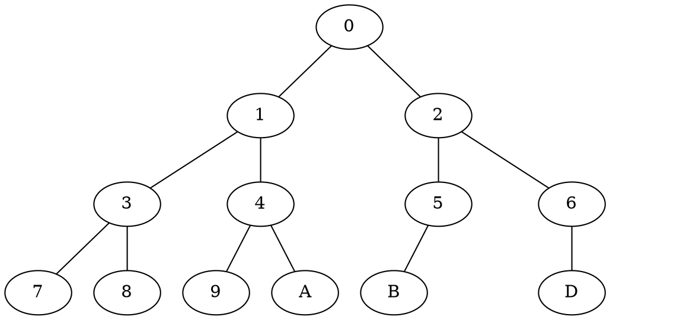

# 树的定义

树是由n(n>=0)个集结点组成的有限集。如果n=0,则为空树；如果n>0,则

1， 有一个特殊的成为根（root）的结点，他只有直接后续，没有直接前序；

2， 除根以外的其他结点划分为m(m>=0)个互不相干的有限集T0， T1， ... T(m-1)。每个集合又是一棵树，并称之为根的子树。 每棵子树的根结点有且仅有一个直接前驱，但可以有0个或是多个直接后驱。

## 术语：

结点node

结点的度 degree

叶结点leaf

分支结点branch

子女结点child

双亲结点parent

兄弟结点sibling

结点所处层次level

树的高度depth

树的度degree

有序树

无序树

## 树的抽象数据类型

```cpp
// 树是由n(n>=0)个结点组成的有限集合。
// position指的是树中结点的地址。顺序存储为下表，链式存储是地址
// Type是树结点中存放数据的类型
template <class Type> class Tree {
public:
    // 构造函数，生成树的结构并初始化
    Tree();
    // 析构函数，释放树所占的存放空间
    virtual ~Tree();
    // 返回树根节点的地址。 为空则返回0
    position Root();
    // 建立树的根结点
    void BuildRoot(const Type& value);
    // 返回结点p的第一个子女的地址，如无返回0
    position FirstChild(position p);
    // 返回结点p的子女v的下一个兄弟的地址，如无返回0
    position NextSibling(position p, position v);
    // 返回结点p的发节点地址 p为根节点，返回0
    position Parent(position p);
    // 返回结点p存放的值
    Type Retrieve(position p);
    // 结点p下面插入子女结点存储数据为value
    // 如果结构中结点已满(二叉树)不能插入，返回0。 成功返回1
    int InsertChild(const position p, const Type &value);
    // 删除结点p的第i个子女以及全部子女结点。 如果子女结点不存在
    int DeleteChild(position p, int i);
    void deleteSubTree(position i);
    int isEmpty();   
}
```


# 二叉树

## 定义

一棵二叉树是结点的一个有限集合，该集合或是为空，或是由一个根结点加两棵分别称为左子树额右子树，的互不相交的二叉树组成。

## 性质

+ 如果从0开始计算层次，则第i层最多有2^i个结点

+ 高度为k的二叉树最大结点树是2^(k+1) -1个

+ 叶结点树为n0,度为2的非叶节点树n0 =  n2 + 1

  二叉树结点总数 n, 度为1的结点个数为n1，   n = n0 + n1 + n2

  二叉树中边条数为e。 

  e = n-1 = n0+n1+n2 -1  除根节点外，进入每个结点都有且仅有一个双亲结点，进入边条数为1. 

  e = 2n2 + n1                   每个度为2的结点发出的边为2， 度为1的结点发出的边为1

## 特殊二叉树

### 满二叉树

每一层结点都达到最大数。 除了最底层的结点度为0外，其他各层的度都是2。 高度为k的节点数 2^(k+1) -1


### 完全二叉树

每个结点都与高度为k的满二叉树的编号结点一一对应。

> + 叶结点尽在层次最大的两层出现
> + 任一结点，右侧高度为l，则左侧只能是l或是l+1

+ n个结点的完全二叉树高度为ceil(log2(n+1) ) -1     2^k -  1< n < 2^k +1 ==> 2^k < n+1 < 2^(k+1)


## 二叉树的数据抽象

```cpp
// 二叉树是有序树
template <class Type> class BinaryTree {
public:
    // 构造函数，构建一个空的二叉树
    BinaryTree();
    // 构造函数，构建一个二叉树，根节点存储数据为item，左子树为lch，右子树为rch
    BinaryTree(BinTreeNode<Type> *lch, BinTreeNode<Type> *rch, Type item);
	// 判断二叉树是否为空，如果为空放回1，否则返回0
    int isEmpty();
    // 返回双亲结点地址
    BinTreeNode<Type> *Parent(BinTreeNode<Type> *);
    // 返回左树结点地址
    BinTreeNode<Type> *LeftChild(BinTreeNode<Type> *);
    // 返回右树结点地址
    BinTreeNode<Type> *RightChild(BinTreeNode<Type> *);
    // 插入新元素
    int Insert(const Type &item);
    // 搜索元素
    int Find(const Type &item) const;
    // 获取结点数据
    Type getData()const;
    // 获取根节点
    const BinTreeNode<Type> *GetRoot() const;
}
```

# 画二叉树

binarytree.gvpr

```gvpr
// from Emden Gansner
// https://mailman.research.att.com/pipermail/graphviz-interest/2010q2/007101.html
// requires GraphViz 2.28.0 (fails with 2.26.3 at least)
BEGIN {
  double tw[node_t];    // width of tree rooted at node
  double nw[node_t];    // width of node
  double xoff[node_t];  // x offset of root from left side of its tree
  double sp = 36;       // extra space between left and right subtrees
  double wd, w, w1, w2; 
  double x, y, z;
  edge_t e1, e2;
  node_t n;
}
BEG_G {
  $.bb = "";
  $tvtype=TV_postfwd;   // visit root after all children visited
}
N {
  sscanf ($.width, "%f", &w);
  w *= 72;  // convert inches to points
  nw[$] = w;
  if ($.outdegree == 0) {
    tw[$] = w;
    xoff[$] = w/2.0;
  }
  else if ($.outdegree == 1) {
    e1 = fstout($);
    w1 = tw[e1.head];    
    tw[$] = w1 + (sp+w)/2.0;
    if (e1.side == "left")
      xoff[$] = tw[$] - w/2.0;
    else
      xoff[$] = w/2.0;
  }
  else {
    e1 = fstout($);
    w1 = tw[e1.head];    
    e2 = nxtout(e1);
    w2 = tw[e2.head];    
    wd = w1 + w2 + sp;
    if (w > wd)
      wd = w;
    tw[$] = wd;
    xoff[$] = w1 + sp/2.0;
  }
}
BEG_G {
  $tvtype=TV_fwd;   // visit root first, then children
}
N {
  if ($.indegree == 0) {
    sscanf ($.pos, "%f,%f", &x, &y);
    $.pos = sprintf("0,%f", y);
  }
  if ($.outdegree == 0) return;
  sscanf ($.pos, "%f,%f", &x, &y);
  wd = tw[$];
  e1 = fstout($);
  n = e1.head;
  sscanf (n.pos, "%f,%f", &z, &y);
  if ($.outdegree == 1) {
    if (e1.side == "left")
      n.pos = sprintf("%f,%f",  x - tw[n] - sp/2.0 + xoff[n], y);
    else
      n.pos = sprintf("%f,%f", x + sp/2.0 + xoff[n], y);
  }
  else {
    n.pos = sprintf("%f,%f", x - tw[n] - sp/2.0 + xoff[n], y);
    e2 = nxtout(e1);
    n = e2.head;
    sscanf (n.pos, "%f,%f", &z, &y);
    n.pos = sprintf("%f,%f", x + sp/2.0 + xoff[n], y);
  }
}
```

FullBinTree.dot



```bash
dot FullBinTree.dot | gvpr -c -f binarytree.gvpr | neato -n -Tpng -o FullBinTree.png
```

CompleteBinTree.dot



> digraph --> graph

```graph
dot CompleteBinTree.dot | gvpr -c -f binarytree.gvpr | neato -n -Tpng -o CompleteBinTree.png
```


# 二叉树的表示

## 数组表示

大小和形状变化比较小的时候

## 链式表示


